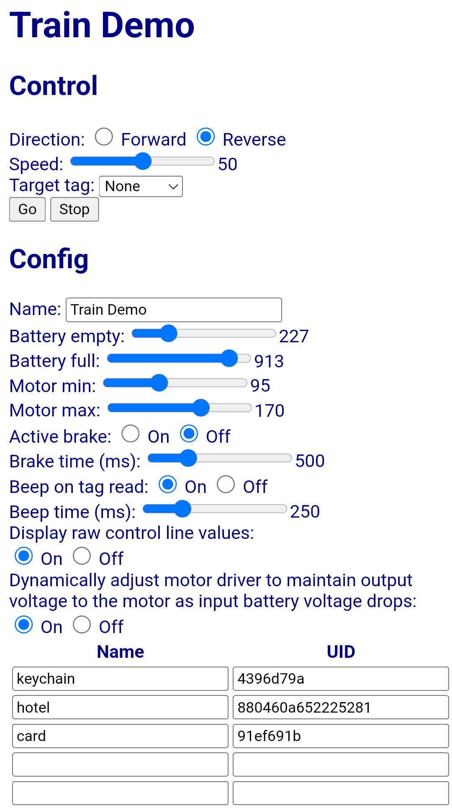
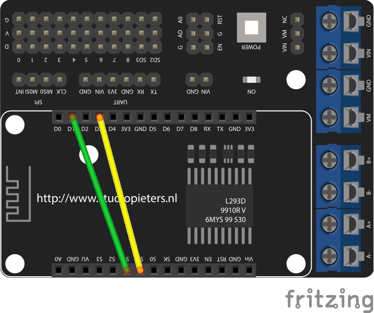

# WiFi Lego train control

Add WiFi control to Power Functions & Powered Up Lego trains. Move and stop at specific locations on the track using RFID tags.

## Software
The main firmware is an Arduino project in (Train/)

A simple responsive UI is served from the train for control/config.



### REST API

All POST calls should be in application/x-www-form-urlencoded format

**`POST /api/control`**

**dir**: `F` for forward, `R` for reverse. Defaults to `F` if omitted

**speed**: `0` for stop, `1-100` percent to move

**rfid**: `next` to move to the next tag or UID of specific tag to move to. If not specified, train will move but not look for an rfid tag

Returns `battery` percent full and the last `rfid` UID found

```json
{
  "dir": "F",
  "speed": "50",
  "rfid": "69b3d9d9",
  "battery": 84
}
```

**`POST /api/config`**

Updates the configuration in flash memory and returns the current configuration parameters and stored tags for the train

**name**: Name of train

**batteryEmpty**: `0-1023` raw value from ADC pin when battery voltage will no longer move the train

**batteryFull**: `0-1023` raw value from ADC pin when batteries are brand new

**motorMin**: `0-255` raw PWM value representing the minimum speed to drive the train (speed=1 on the control API)

**motorMax**: `0-255` raw PWM value representing the maximum speed to drive the train at

**activeBrake**: `true`/`false` when true, train will reverse the motor direction to stop the train when it finds the target rfid

**brakeTimeMS**: `0-2000` how many milliseconds to reverse for when active braking

**beep**: `true`/`false` beep the buzzer whenever an rfid tag is read

**beepMS**: `0-1000` how long the beep should be in milliseconds

**displayRaw**: `true`/`false` when true, raw values ADC/PWM values are displayed for battery and motor. When false, graphics are displayed

**dynamicPower**: `true`/`false` when true, as battery voltage drops, PWM outputs are increased propotionally to the battery min/max values to try to maintain the same voltage to the train motor,

**tagName** / **tag**: must be sent in pairs.  `tagName` is human readable, `tag` is the UID of the rfid tag in hex

**`GET /api/config`**

Returns the current configuration parameters and stored tags for the train

```json
{
  "configVersion": 7,
  "buildTimestamp": "Feb 19 2022 12:39:52",
  "name": "Train 1",
  "batteryEmpty": 475,
  "batteryFull": 913,
  "motorMin": 95,
  "motorMax": 135,
  "activeBrake": true,
  "brakeTimeMS": 200,
  "beep": true,
  "beepMS": 250,
  "displayRaw": false,
  "dynamicPower": true,
  "tags": [
    {
      "tagName": "2",
      "tag": "69b3d9d9"
    },
    {
      "tagName": "4",
      "tag": "2ecbd9d9"
    },
    {
      "tagName": "7",
      "tag": "de2adbd9"
    },
    {
      "tagName": "",
      "tag": ""
    },
    {
      "tagName": "",
      "tag": ""
    },
    {
      "tagName": "",
      "tag": ""
    },
    {
      "tagName": "",
      "tag": ""
    },
    {
      "tagName": "",
      "tag": ""
    },
    {
      "tagName": "",
      "tag": ""
    },
    {
      "tagName": "",
      "tag": ""
    }
  ]
}
```

### Lego Powered UP firmware
If using a Powered Up train, you'll first need to load [Pybricks](https://pybricks.com/) and program from [pybricks/](pybricks/)

### Train emulator
A node/express-based emulator for the train firmware is provided in [SoftTrain/](SoftTrain/) to test calling the train API and simplify developing the UI without hardware

## Hardware

 * [RTL8720dn](https://www.amebaiot.com/en/amebad-bw16-arduino-getting-started/)
 * DOIT NodeMCU L293 motor shield
 * 7941W dual frequenct RFID reader/writer
 * 0.96" I2C SSD1306 display
 * Piezo buzzer

The RTL8720dn shares the size and most of the pinout with the esp8266-based NodeMCU, however two pins must be bridged on the shield to connect the output pins on the controller to the port A input pins on the shield (which are not connected to anything on the RTL8720dn).

